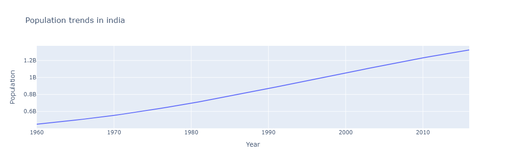
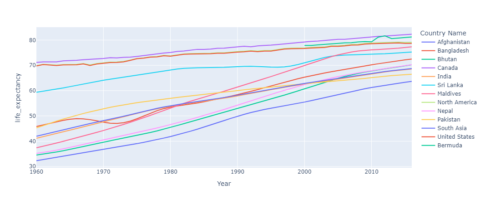
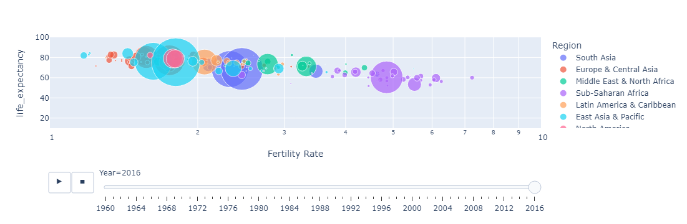

# WEEK 4
**Output**  
# **Population of inda over the year**
  
# **Region Wise Population over the year**
  
# **Fertility Rate vs Life Expectancy**  
  
# **Population vs Life Expectancy**  

These plots are dynamic, GitHub don't show them.
If you need to see, then copy the notebook link from my repo.  
Go to this website [NBViewer](https://nbviewer.org/) and place the link and see them :)
